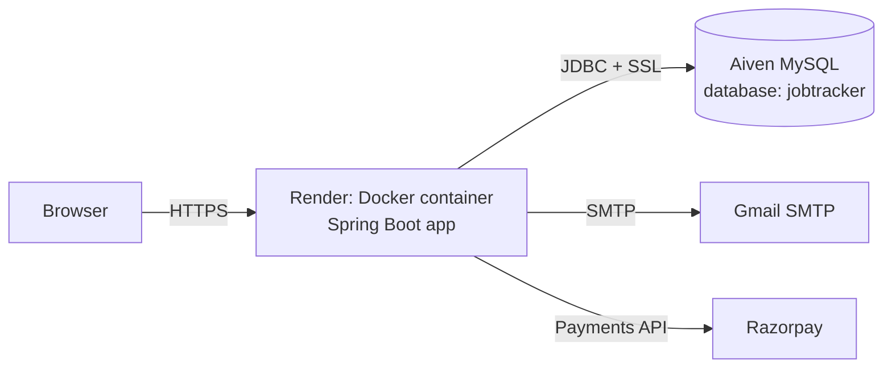

# JobTrackr

A job application tracker built with **Spring Boot, Spring Security (JWT), JPA/Hibernate, Flyway and MySQL**. Users register, log in and track every application from wishlist to offer, with follow-up reminders, a table and board view, and a free/pro plan. Deployed with **Docker on Render**, using a managed **MySQL database on Aiven**.

**Live demo:** https://jobtracker-kgju.onrender.com
**Repo:** https://github.com/karshhkr/jobtracker

> The demo runs on free tiers. Render sleeps after 15 minutes of inactivity, so the first load can take 30-60 seconds.

---

## Screenshots

| Dashboard (dark) | Board view |
|---|---|
|  [SignUp] () 
|  [Login]()
|  
|  


| Add application | Pricing / plans |
|---|---|
|  |  |

---

## Features

- **Authentication:** register and login with stateless JWT tokens, secured with Spring Security.
- **Application tracking:** add, edit and delete applications with company, role, location, applied date and follow-up date.
- **Status pipeline:** Wishlist, Applied, Interview, Offer, Rejected, with live counts on the dashboard.
- **Table and Board views:** switch layouts, plus search by company, role or location and a status filter.
- **Follow-up reminders:** a scheduled job (daily at 9 AM) checks due follow-ups and sends email through Gmail SMTP.
- **Plans:** free plan limited to 10 applications, and a Pro plan with Razorpay payments (a mock payment mode is available for testing).
- **Per-user data:** every user only sees and changes their own applications.
- **Light and dark theme** toggle.

---

## Tech stack

| Layer | Technology |
|---|---|
| Language / Runtime | Java 17 |
| Framework | Spring Boot 4, Spring MVC |
| Security | Spring Security, JWT |
| Persistence | Spring Data JPA, Hibernate |
| Database | MySQL 8 (Aiven in production) |
| Migrations | Flyway |
| Payments | Razorpay (test mode) with a mock fallback |
| Email | Spring Mail, Gmail SMTP |
| Build | Maven |
| Containers / Hosting | Docker, Render |

---

## Architecture



Request flow: the browser sends a JWT in each request, a filter validates it, controllers call services, and services use JPA repositories to read and write MySQL. Flyway creates and versions the schema when the app starts.

---

## Database

Schema is managed only by Flyway migrations in `src/main/resources/db/migration` (Hibernate runs with `ddl-auto=none`).

Tables: `users`, `job_applications`, `companies`, `reminders`, `subscriptions`, `payments`, and Flyway's own `flyway_schema_history`.

Every table has a primary key, which Aiven's managed MySQL requires.

---

## Run locally

**Prerequisites:** Java 17, Maven, MySQL 8.

```bash
git clone https://github.com/karshhkr/jobtracker.git
cd jobtracker
```

With no environment variables set, the app falls back to a local MySQL on `localhost:3306` and creates the `jobtracker` database if needed.

```bash
mvn spring-boot:run
```

Open http://localhost:8080.

### Environment variables

| Variable | Purpose | Default |
|---|---|---|
| `DB_URL` | JDBC URL of the database | local MySQL |
| `DB_USERNAME` | Database user | `root` |
| `DB_PASSWORD` | Database password | local default |
| `JWT_SECRET` | Secret used to sign tokens (use 32+ random characters) | dev-only value |
| `MAIL_USERNAME` / `MAIL_PASSWORD` | Gmail address and Gmail **app password** | empty |
| `MOCK_PAYMENTS` | `true` to skip real Razorpay calls | `false` |
| `RAZORPAY_KEY_ID`, `RAZORPAY_KEY_SECRET`, `RAZORPAY_WEBHOOK_SECRET` | Razorpay keys | placeholders |
| `PORT` | HTTP port (Render sets this) | `8080` |

Never commit real secrets. Keep them in environment variables.

---

## Deployment

1. **Database:** create a MySQL service on Aiven, create a `jobtracker` database and a dedicated user limited to that database.
2. **App:** the multi-stage `Dockerfile` builds the jar with Maven and runs it on a slim Java 17 image.
3. **Render:** create a Web Service from this repo (Docker runtime) and set the environment variables above. Example database URL:

```
jdbc:mysql://<aiven-host>:<port>/jobtracker?sslMode=REQUIRED
```

4. Flyway runs automatically on startup and creates the tables.

---

## Project structure

```
jobtracker
├── Dockerfile
├── pom.xml
└── src/main
    ├── java/com/utkarsh/jobtracker
    │   ├── security/        JWT utility and authentication filter
    │   └── ...              controllers, services, repositories, entities
    └── resources
        ├── application.properties
        └── db/migration     V1__init.sql, V2__companies.sql
```

---

## What I learned

- Securing a REST API with stateless JWT and Spring Security.
- Versioned schema changes with Flyway instead of letting Hibernate create tables.
- Keeping secrets out of code with environment variables, and what happens when they leak into git history.
- Containerising a Spring Boot app and deploying it on a free cloud tier.
- Debugging real deployment problems: wrong config file location, managed-database rules (every table needs a primary key), and port binding on Render.

## Future improvements

- Automated tests (unit and integration with Testcontainers).
- Resume or document upload per application.
- Email and calendar integration for interview scheduling.
- Move to a database tier that does not power off when idle.

---

## Author

**Utkarsh Kumar Dabgarwal**: Java backend developer, Noida, India
GitHub: [karshhkr](https://github.com/karshhkr)
